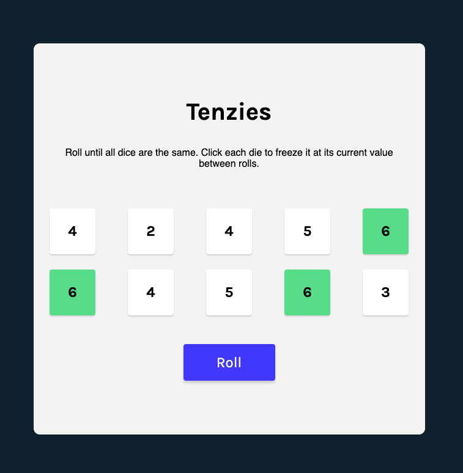

# 🎲 Tenzies Game

A responsive **React-based Tenzies game** — roll the dice, hold your numbers, and win when all match!  
Built with React hooks and modern styling.

---

<!-- ## 🚀 Live Demo
[View on Vercel](https://YOUR_VERCEL_PROJECT_URL)   -->

---

## ✨ Features
- 🎲 Roll 10 dice and hold matching numbers
- 🖱 Click to freeze individual dice
- 🏆 Win when all dice have the same value
- 📱 Responsive and clean UI
- ⚡ Fast gameplay with React hooks

---

## 🛠 Built With
- [React](https://react.dev/)
- [Vite](https://vitejs.dev/)
- [nanoid](https://github.com/ai/nanoid) (unique IDs)
- [react-confetti](https://github.com/alampros/react-confetti) (celebration effect)

---

## 📦 Installation & Setup

1. **Clone the repository**
   ```bash
   git clone https://github.com/YOUR_USERNAME/tenzies-game.git
   cd tenzies-game
   ```

2. **Install dependencies**
   ```bash
   npm install
   ```

3. **Run the app**
   ```bash
   npm run dev
   ```

4. **Build for production**
   ```bash
   npm run build
   ```

---

## 📸 Screenshot

